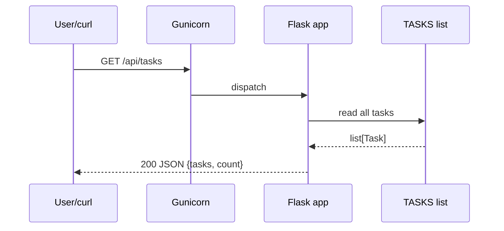
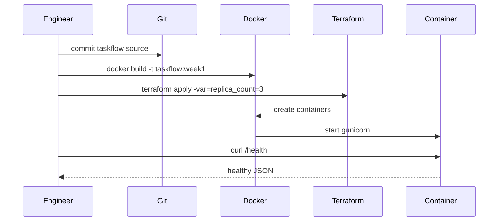

# Component Interactions — TaskFlow (Reference)

## Component catalog

| Component | Type | Inputs | Outputs |
|-----------|------|--------|---------|
| `app.py` | Application | HTTP requests, env vars | JSON responses |
| Gunicorn | Process manager | WSGI calls | HTTP on :8080 |
| `TASKS` store | In-memory data | Domain reads/writes | Task objects |
| Docker image | Artifact | Source, Dockerfile | `taskflow:week1` |
| Terraform | Provisioner | `replica_count`, image | Running containers |
| Health probe | Orchestrator check | GET `/health` | 200 + JSON |

## Interaction diagram — list tasks

## Interaction diagram — deploy path (Week 1 lab)

## Critical paths

1. **Read path** — `GET /api/tasks` → in-memory list → JSON (no I/O blocking).
2. **Health path** — `GET /health` → used by Docker HEALTHCHECK and lab checks.
3. **Deploy path** — build image → terraform apply → verify health on each replica port.

## Failure modes

| Failure | Impact | Mitigation |
|---------|--------|------------|
| Container crash | Replica unavailable | Terraform recreate; compose restart policy |
| Image not built | `terraform apply` fails | `solve.sh` builds before apply |
| Port collision | Container start fails | `base_port` offset per replica index |
| Process hang | Health check fails | Docker HEALTHCHECK retries; observe logs |