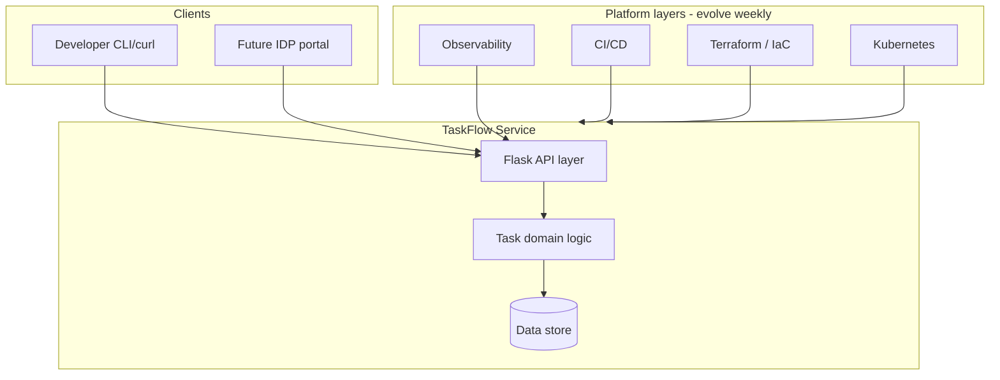
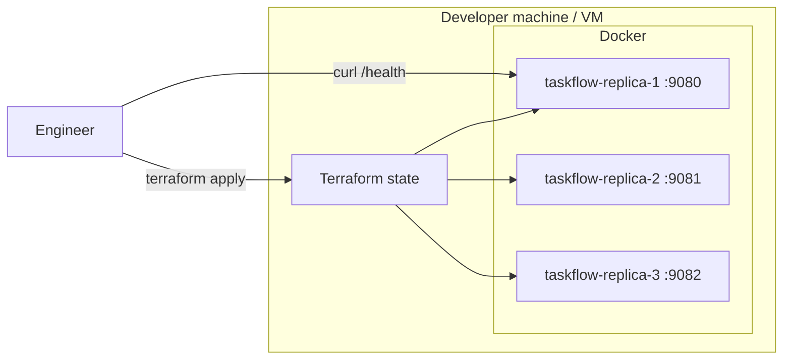

# System Architecture — TaskFlow (Reference)

## Architecture goals

1. **Teachable** — each bootcamp week adds one platform layer without rewrites.
2. **Observable** — health endpoint from day one; metrics/traces added Week 17.
3. **Portable** — runs locally, in Docker, and on orchestrators.
4. **Portfolio-ready** — documentation and diagrams employers can skim on GitHub.

## Logical architecture

## Physical / deployment architecture (Week 1)

## Boundaries and responsibilities

| Layer | Components | Owns |
|-------|------------|------|
| Application | `app.py`, Gunicorn | HTTP contract, task semantics |
| Packaging | `Dockerfile`, image | Reproducible runtime |
| Provisioning | Terraform `main.tf` | Replica count, ports, labels |
| Operations | `observe.sh`, Docker logs | Runtime inspection (Week 1) |

## Non-functional requirements

| NFR | Target | How architecture supports it |
|-----|--------|------------------------------|
| Availability | Best-effort Week 1 | Multiple replicas via Terraform `count` |
| Latency | < 100ms p95 local | In-memory reads, 2 Gunicorn workers |
| Portability | Linux container | Slim Python base image |
| Security | Dev-only Week 1 | No auth; secrets in Week 18 |
| Evolvability | Weekly increments | Clear layer boundaries in diagrams |