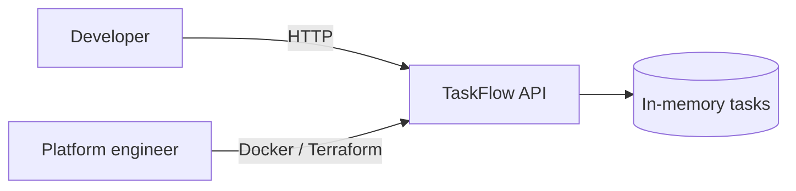
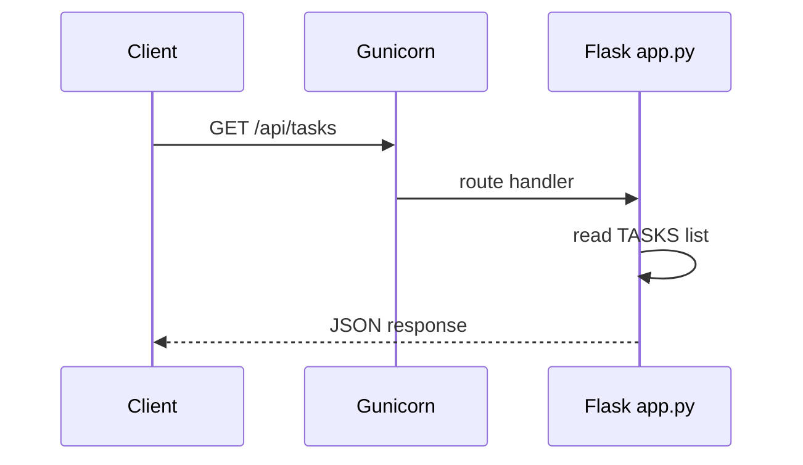

# TaskFlow Architecture (Week 1)

## Overview

TaskFlow Week 1 is a **single-process Flask API** served by Gunicorn in production containers. It is intentionally small — a stand-in that gains platform capabilities each bootcamp week.

## System context

## Components

| Component | Technology | Responsibility |
|-----------|------------|----------------|
| HTTP API | Flask 3.x | Routes, JSON responses |
| WSGI server | Gunicorn | Production process model in container |
| Data store | In-memory list | Week 1 stub; replaced in later weeks |
| Container | Docker | Portable runtime artifact |
| IaC | Terraform (docker provider) | Managed replicas (lab-platform-path) |

## Request flow

## Deployment views

**Local:** `python app.py` binds `0.0.0.0:PORT`.

**Container:** Image `taskflow:week1`, exposes 8080, `HEALTHCHECK` on `/health`.

**Terraform:** `replica_count` docker containers on ports 9080+ (see `lab-platform-path/terraform`).

## Design decisions (Week 1)

| Decision | Rationale | Revisit |
|----------|-----------|---------|
| In-memory tasks | Fast bootcamp start; no DB ops in Week 1 | Week 6+ |
| JSON-only API | Simple contract for labs and curl checks | When UI added |
| Flask over FastAPI | Minimal deps; Python foundations week ahead | Optional later |

## Security (Week 1 scope)

- No authentication — internal bootcamp use only
- No secrets in image; `TASKFLOW_VERSION` via env
- Production hardening deferred to Week 21

## Evolution path

Subsequent weeks add persistence, auth, K8s manifests, Helm, observability, and IDP integration without rewriting the core API contract.