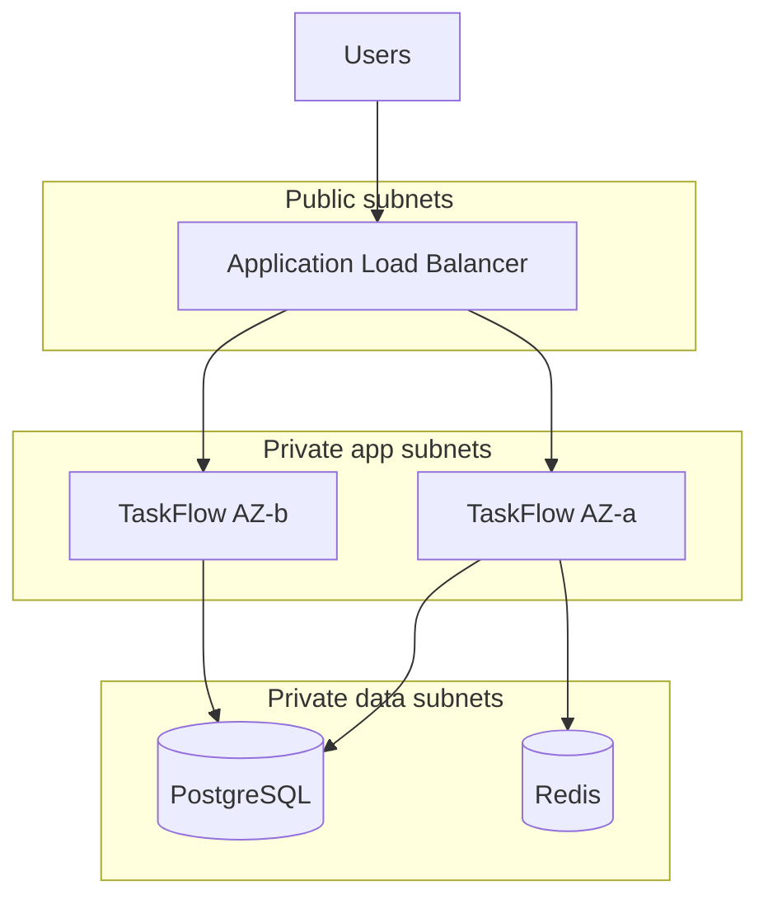

# TaskFlow Network Architecture Decisions (Reference)

## ADR-001: Non-overlapping /16 per environment

- **Decision:** dev `10.10/16`, staging `10.20/16`, prod `10.30/16`
- **Rationale:** Enables future VPC peering and VPN without renumbering
- **Week 10:** Terraform `aws_vpc` modules consume these YAML specs

## ADR-002: 3-tier subnet model

| Tier | Placement | Routes |
|------|-----------|--------|
| Web | Public subnets | IGW default route |
| App | Private subnets | NAT for egress |
| Data | Private isolated | No internet; SG from app only |

## ADR-003: Multi-AZ progression

- dev: 1 AZ
- staging: 2 AZ
- prod: 3 AZ

## High availability patterns

## Security summary

- **Security groups:** stateful, least privilege between tiers
- **NACLs:** stateless subnet guardrails (deny unexpected ports)
- **No public IPs** on app or data tiers

## AWS prep checklist (Week 10)

- [ ] Import YAML into Terraform variables
- [ ] Create IGW, NAT, route tables
- [ ] Attach SGs to TaskFlow ASG / EKS nodes